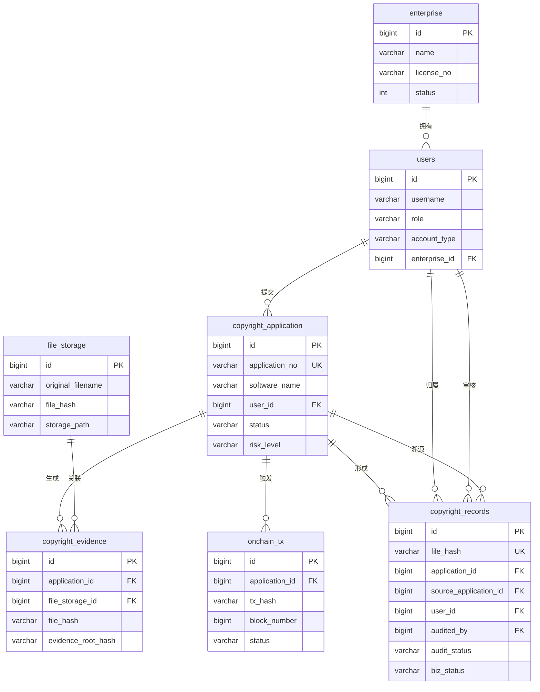

# 版权云链 ER 图（核心版）

> 说明：本图基于 `db.sql` 提炼，仅保留核心实体、关键属性与主要关系，适合文档展示与评审沟通。

```mermaid
erDiagram
    %% ========== 主体层 ==========
    enterprise {
        bigint id PK
        varchar name
        varchar license_no
        int status
    }

    users {
        bigint id PK
        varchar username
        varchar role
        varchar account_type
        bigint enterprise_id FK
    }

    %% ========== 申请与证据层 ==========
    copyright_application {
        bigint id PK
        varchar application_no UK
        varchar software_name
        bigint user_id FK
        varchar status
        varchar risk_level
    }

    file_storage {
        bigint id PK
        varchar original_filename
        varchar file_hash
        varchar storage_path
    }

    copyright_evidence {
        bigint id PK
        bigint application_id FK
        bigint file_storage_id FK
        varchar file_hash
        varchar evidence_root_hash
    }

    %% ========== 上链与结果层 ==========
    onchain_tx {
        bigint id PK
        bigint application_id FK
        varchar tx_hash
        bigint block_number
        varchar status
    }

    copyright_records {
        bigint id PK
        varchar file_hash UK
        bigint application_id FK
        bigint source_application_id FK
        bigint user_id FK
        bigint audited_by FK
        varchar audit_status
        varchar biz_status
    }

    %% ========== 关系 ==========
    enterprise ||--o{ users : "拥有"
    users ||--o{ copyright_application : "提交"
    copyright_application ||--o{ copyright_evidence : "生成"
    file_storage ||--o{ copyright_evidence : "关联"
    copyright_application ||--o{ onchain_tx : "触发"
    copyright_application ||--o{ copyright_records : "形成"
    users ||--o{ copyright_records : "归属"
    users ||--o{ copyright_records : "审核"
    copyright_application ||--o{ copyright_records : "溯源"
```

## 关系主链路

`enterprise/users -> copyright_application -> copyright_evidence/onchain_tx -> copyright_records`

