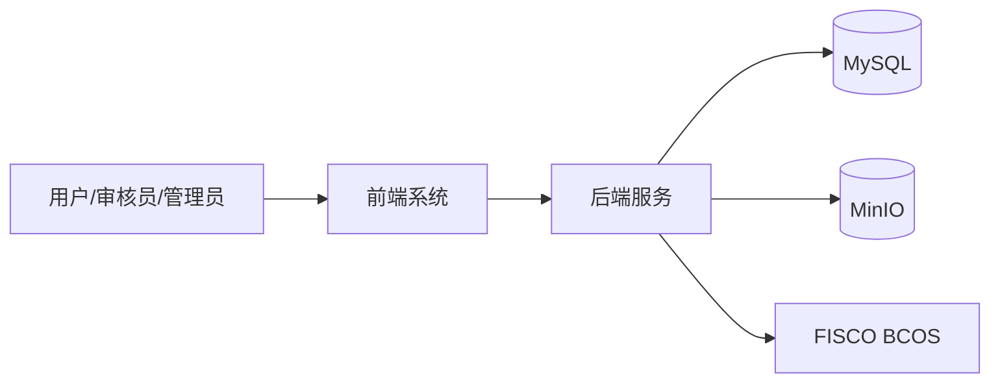
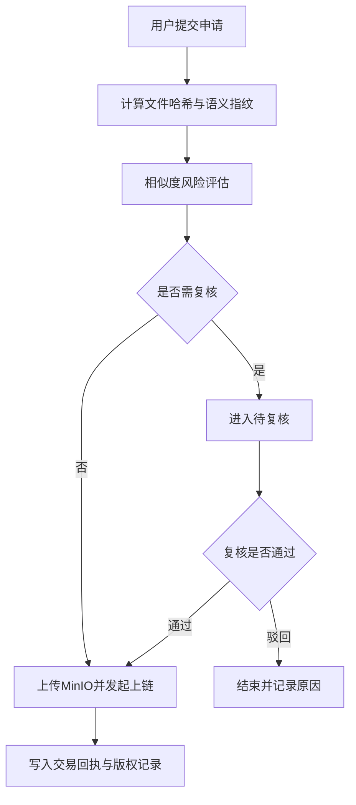

# 软件著作权申请材料（可打印提交版）

---

## 封面

**软件名称**：版权云链  
**副标题**：软件版权溯源与确权平台  
**文档类型**：技术文档鉴别材料（含程序设计说明与使用说明）  
**版本号**：V1.0  
**完成日期**：2026-04-26  
**著作权人**：____________________  
**联系人**：____________________  
**联系电话**：____________________  

> 打印说明：封面单独成页，正文从下一页开始。

---

## 文档使用说明（提交前请删除本页）

1. 本文档用于整合软著申请中的技术材料；  
2. 文中“截图占位”处请替换为真实系统截图；  
3. 文中下划线处补齐申请主体信息；  
4. 全文完成后导出 PDF（建议 A4，页码连续）。

---

## 目录

1. 软件概述  
2. 技术架构与运行环境  
3. 功能规格说明  
4. 程序设计说明  
5. 关键流程图  
6. 数据库与接口说明  
7. 安全与权限说明  
8. 开发与测试说明  
9. 用户操作说明  
10. 系统界面截图（附图）  
11. 附录

---

## 1. 软件概述

“版权云链（软件版权溯源与确权平台）”是一套面向软件作品的存证、溯源与确权系统。平台支持个人与企业主体进行版权申请，通过文件指纹提取、风险评估、人工复核、联盟链上存证等流程形成可追溯的版权证据链。

系统目标如下：

- 提升软件版权确权效率；
- 降低举证与维权成本；
- 依托区块链提升证据可信度与不可篡改性；
- 提供统一的申请、审核、查询、管理功能。

---

## 2. 技术架构与运行环境

### 2.1 技术架构

- 前端：Vue 3 + Vite + Element Plus  
- 后端：Spring Boot + Spring Security + MyBatis-Plus  
- 数据库：MySQL  
- 对象存储：MinIO  
- 区块链：FISCO BCOS（联盟链）

### 2.2 架构逻辑图

### 2.3 运行环境

- 操作系统：Windows / Linux（64 位）  
- JDK：17+  
- Node.js：20+  
- MySQL：8.x  
- MinIO：S3 兼容版本  
- FISCO BCOS：3.x

---

## 3. 功能规格说明

### 3.1 用户与权限管理

- 注册、登录、个人资料维护、密码修改；  
- 角色包含个人开发者、企业开发者、企业法务、审核员、管理员；  
- 按角色与主体类型控制菜单与接口权限。

### 3.2 版权申请与存证

- 上传软件文件并提交申请；  
- 生成申请编号并返回处理状态；  
- 支持状态查询与轮询；  
- 完成链上确权后生成交易凭证。

### 3.3 风险评估与人工复核

- 基于语义哈希进行相似度评估；  
- 命中阈值触发复核流程；  
- 复核通过后上链，驳回后终止。

### 3.4 查询溯源

- 支持按文件哈希查询；  
- 返回申请编号、业务状态、交易哈希、区块号等信息。

### 3.5 审核与后台管理

- 审核员处理待审记录；  
- 管理员进行账号、角色、企业、版权记录管理；  
- 查看统计信息与平台运行数据。

---

## 4. 程序设计说明

### 4.1 分层设计

1. 表示层：页面展示与用户交互；  
2. 接口层：REST API；  
3. 业务层：申请、审核、上链、查询等业务编排；  
4. 数据层：实体与数据库映射；  
5. 基础设施层：JWT、安全、存储与区块链接入。

### 4.2 核心模块

- 认证模块：用户身份认证与令牌签发；  
- 申请模块：文件接收、哈希提取、申请落库；  
- 证据模块：证据摘要生成与管理；  
- 上链模块：智能合约调用与交易结果记录；  
- 审核模块：审核与复核流程控制；  
- 查询模块：对外溯源查询与详情展示。

---

## 5. 关键流程图

### 5.1 申请上链流程

### 5.2 查询流程

用户输入文件哈希后，系统检索版权记录并展示申请编号、状态、交易哈希、区块高度，实现存证信息追溯。

---

## 6. 数据库与接口说明

### 6.1 核心数据表

- `users`（用户表）  
- `enterprise`（企业表）  
- `copyright_application`（申请表）  
- `copyright_evidence`（证据表）  
- `copyright_records`（版权记录表）  
- `onchain_tx`（链上交易表）  
- `file_storage`（文件存储表）

### 6.2 接口分组

- 认证接口：`/api/auth/**`  
- 版权业务接口：`/api/copyright/**`  
- 审核接口：`/api/audit/**`  
- 管理接口：`/api/admin/**`

---

## 7. 安全与权限说明

- 使用 Spring Security + JWT 实现无状态认证；  
- 使用 BCrypt 加密保存密码；  
- 对不同角色设置差异化访问控制；  
- 原始文件不直接上链，仅将摘要信息上链；  
- 保留申请、审核、交易日志便于审计追踪。

---

## 8. 开发与测试说明

### 8.1 开发说明

- 采用前后端分离开发模式；  
- 后端实现规则引擎、权限控制与链上集成；  
- 前端实现角色化页面与流程交互。

### 8.2 测试说明

已覆盖的重点测试包括：

- 指纹算法与相似度逻辑测试；  
- 权限规则兼容性测试。

建议补充联调测试：

- 注册登录、申请提交、状态轮询、复核分支、上链成功/失败、公开查询与后台管理等场景。

---

## 9. 用户操作说明

### 9.1 普通用户

1. 注册/登录；  
2. 进入申请页上传文件并提交；  
3. 查看申请结果与交易凭证；  
4. 通过哈希查询记录真伪。

### 9.2 审核员

1. 登录审核账号；  
2. 进入审核列表；  
3. 对高风险申请做通过/驳回处理。

### 9.3 管理员

1. 进入后台管理；  
2. 进行账号与角色管理；  
3. 查看版权记录与统计数据。

---

## 10. 系统界面截图（附图）

> 请将以下占位替换为真实截图，图题编号建议连续。

### 图 10-1 首页

【截图占位：01-首页.png】

图注：系统首页提供版权溯源入口，用户可直接输入文件哈希进行检索。

### 图 10-2 登录页

【截图占位：02-登录页面.png】

图注：用户输入账号密码完成登录，并根据角色进入对应功能页面。

### 图 10-3 注册页

【截图占位：03-注册页面.png】

图注：支持个人主体与企业主体注册。

### 图 10-4 版权申请页

【截图占位：04-版权申请表单.png】

图注：用户填写软件名称、描述并上传文件发起存证申请。

### 图 10-5 申请结果页

【截图占位：06-申请提交结果.png】

图注：系统返回申请编号与当前处理状态。

### 图 10-6 上链成功页

【截图占位：07-上链成功结果.png】

图注：展示链上交易哈希与业务状态，形成确权凭证。

### 图 10-7 哈希查询结果页

【截图占位：09-哈希查询结果.png】

图注：展示申请编号、交易哈希、区块高度等溯源信息。

### 图 10-8 审核页

【截图占位：14-审核列表.png】

图注：审核员可查看待处理记录并进行审核操作。

### 图 10-9 管理后台页

【截图占位：16-管理员后台.png】

图注：管理员可进行账号、角色、版权记录与统计管理。

---

## 11. 附录

### 11.1 相关文档清单

- `软著-文档鉴别材料-版权云链.md`  
- `软著-程序设计说明书-版权云链.md`  
- `软著-操作截图清单与说明-版权云链.md`

### 11.2 提交前核对清单

- [ ] 软件名称是否全篇一致；  
- [ ] 截图是否清晰且编号连续；  
- [ ] 关键页面是否覆盖申请、查询、审核、管理；  
- [ ] 联系人与著作权人信息是否补全；  
- [ ] 是否已导出最终 PDF 版本。

