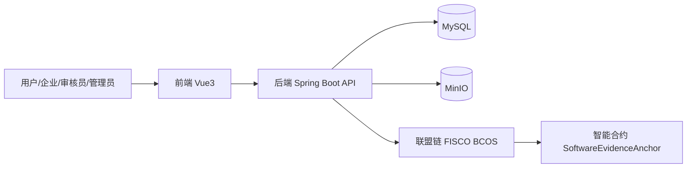
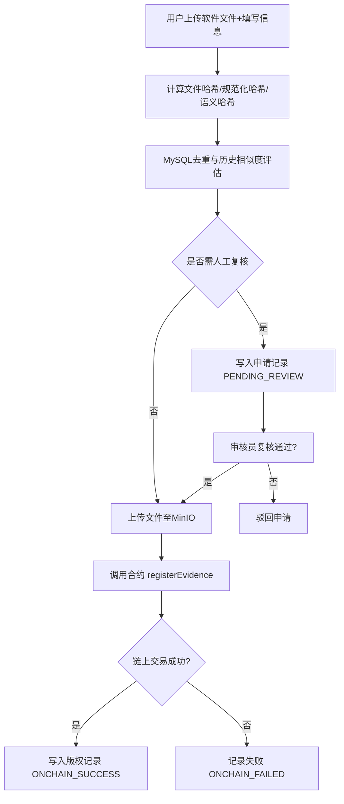

# 版权云链（软件版权溯源与确权平台）

## 文档鉴别材料（软著申请用）

---

## 1. 文档说明

- **软件名称**：版权云链
- **副标题**：软件版权溯源与确权平台
- **文档性质**：程序设计说明书 + 功能规格说明 + 用户使用说明 + 测试情况说明
- **适用版本**：当前项目版本（后端 `copyrightsoft` + 前端 `copyrightsoft-ui`）
- **编写目的**：用于软件著作权申请中的“文档鉴别材料”提交

---

## 2. 软件概述

“版权云链”是一套面向软件代码资产的版权存证、溯源与确权平台。系统支持个人主体与企业主体提交软件包进行版权申请，自动完成文件指纹提取、相似度风险评估、人工复核流转、联盟链上存证以及链上凭证查询，形成“提交-核验-上链-审计-追溯”的闭环流程。

系统核心目标如下：

- 降低软件版权登记过程中的举证成本；
- 通过区块链不可篡改特性提升证据可信度；
- 提供统一的申请、审核、查询、管理界面；
- 支持企业内部多角色协作（管理员、开发者、法务）；
- 对高相似申请进行风险拦截与人工复核，降低重复提交和侵权风险。

---

## 3. 软件组成与运行环境

### 3.1 整体组成

系统由以下模块组成：

- **前端展示层**：Vue 3 + Vite + Element Plus，实现用户交互、申请提交、状态轮询、详情查询和后台管理；
- **后端服务层**：Spring Boot + Spring Security + MyBatis-Plus，提供认证鉴权、业务编排、数据持久化与链上交互能力；
- **链下数据库**：MySQL，存储用户、申请、证据、交易、审计等业务数据；
- **对象存储**：MinIO，保存用户上传的软件文件包；
- **联盟链网络**：FISCO BCOS，执行智能合约并保存关键证据哈希。

### 3.2 技术栈与依赖

- 后端：Java 17、Spring Boot、Spring Security、MyBatis-Plus、JWT、MinIO SDK、FISCO BCOS Java SDK
- 前端：Vue 3、Pinia、Vue Router、Axios、Element Plus、Vite
- 数据库：MySQL
- 区块链：FISCO BCOS 3.x

### 3.3 运行环境建议

- 操作系统：Windows / Linux（64 位）
- JDK：17 或以上
- Node.js：20.x 或以上
- MySQL：8.x
- MinIO：RELEASE 版本（兼容 S3 API）
- FISCO BCOS：3.11.0（项目描述中的已部署版本）

---

## 4. 总体架构设计

### 4.1 分层架构

1. **表示层**：页面路由与表单交互，提供登录注册、版权申请、公开查询、审核管理等功能。
2. **接口层**：REST API（`/api/auth`、`/api/copyright`、`/api/audit`、`/api/admin`）。
3. **业务层**：封装申请受理、风险判定、复核上链、权限规则、审计处理等核心逻辑。
4. **数据层**：MyBatis-Plus Mapper 访问 MySQL。
5. **基础设施层**：MinIO 文件存储、JWT 认证、FISCO BCOS 合约调用。

### 4.2 架构示意图（逻辑）

---

## 5. 数据设计与核心对象

### 5.1 主要数据表

根据当前数据库脚本，核心业务表包含：

- `users`：用户与角色主体信息（个人/企业、审核员、管理员）
- `enterprise`：企业主体信息
- `copyright_application`：版权申请主表（状态、相似度、风险等级）
- `copyright_evidence`：证据摘要（文件哈希、元数据哈希、证据根哈希、语义哈希）
- `copyright_records`：上链成功后的版权记录
- `onchain_tx`：链上交易记录（状态、交易哈希、区块号、异常信息）
- `file_storage`：上传文件存储映射信息

### 5.2 核心状态字段

- 业务状态（`bizStatus`）：`SUBMITTED`、`AUTO_CHECKED`、`PENDING_REVIEW`、`ONCHAIN_SUCCESS`、`ONCHAIN_FAILED`、`REJECTED`
- 审核状态（`auditStatus`）：`PENDING`、`APPROVED`、`REJECTED`
- 风险等级（`riskLevel`）：`LOW`、`MEDIUM`、`HIGH`

---

## 6. 关键业务流程设计

### 6.1 版权申请与上链流程

### 6.2 风险评估策略

- 系统从历史版权记录中抽取最近样本进行语义相似度计算；
- 当相似度达到中高阈值时，触发人工复核；
- 跨主体高相似样本优先判定为高风险；
- 同主体历史版本高相似通常视为中风险，可自动通过或降低拦截强度。

### 6.3 公开查询流程

- 支持通过文件哈希查询版权记录；
- 返回申请编号、软件名称、链上交易哈希、区块高度、状态等信息；
- 供第三方进行快速溯源与真伪辅助验证。

---

## 7. 功能规格说明

### 7.1 用户与权限管理

- 用户注册登录、JWT 鉴权、个人资料维护、密码修改；
- 主体类型区分：个人主体与企业主体；
- 平台角色：个人开发者、企业开发者、企业法务、审核员、管理员；
- 路由与接口双重权限控制，限制越权访问。

### 7.2 版权申请模块

- 上传软件文件并填写软件名称、描述；
- 自动生成申请编号并返回提交状态；
- 对处理中申请进行轮询查询；
- 支持个人与企业主体按规则提交。

### 7.3 证据处理与链上存证模块

- 计算文件 SHA-256、元数据哈希和证据根哈希；
- 计算规范化指纹与语义指纹用于相似度检测；
- 文件存储到 MinIO，链上只保存关键哈希摘要；
- 调用智能合约完成确权登记并记录交易结果。

### 7.4 审核与复核模块

- 审核员查看待审记录，执行通过/驳回；
- 对高风险申请执行人工复核；
- 复核通过后触发上链，复核驳回则终止申请流程；
- 保留审核意见、审核人、审核时间等审计信息。

### 7.5 管理后台模块

- 用户账号管理：创建、编辑、启停、删除、重置密码、角色分配；
- 企业列表检索与绑定；
- 版权记录全量检索与状态过滤；
- 平台统计信息展示（用户总量、活跃用户等）。

### 7.6 查询与展示模块

- 首页快速哈希检索；
- 申请详情页展示链上与业务状态；
- 个人记录、企业记录视图；
- 支持状态中文映射与可读性展示。

---

## 8. 接口设计概述

### 8.1 认证接口（`/api/auth`）

- `POST /login`：登录
- `POST /register`：个人注册
- `POST /register/enterprise`：企业注册
- `GET /info`：当前用户信息
- `PUT /profile`：更新个人信息
- `PUT /password`：修改密码

### 8.2 版权接口（`/api/copyright`）

- `POST /apply`：直接申请（兼容入口）
- `POST /applications`：提交版权申请
- `GET /applications/{applicationNo}`：查询申请状态
- `GET /query/hash/{fileHash}`：按哈希公开查询
- `GET /query/application/{applicationNo}`：按申请号查询
- `GET /my-records`：我的记录分页
- `GET /enterprise-records`：企业记录分页

### 8.3 审核接口（`/api/audit`）

- `GET /records`：审核列表
- `GET /records/application/{applicationNo}`：审核详情
- `POST /records/{id}/action`：审核操作
- `POST /applications/{id}/action`：复核操作

### 8.4 管理接口（`/api/admin`）

- 用户管理、角色分配、密码重置、统计查询、企业列表、版权全量管理等后台接口

---

## 9. 安全设计说明

- 基于 Spring Security + JWT 的无状态认证；
- 密码使用 BCrypt 加密存储；
- 接口按角色与主体类型控制访问；
- 文件原文不上链，仅链上保存哈希摘要，降低敏感信息泄露风险；
- 链上写入前先校验证据根哈希是否已存在，避免重复注册。

---

## 10. 开发情况说明

### 10.1 开发组织形态

- 前后端分离开发；
- 后端负责业务规则、权限、数据与链上集成；
- 前端负责角色化页面、业务流程编排和交互反馈；
- 通过统一 REST API 联调。

### 10.2 开发特点

- 引入“规范化哈希 + 语义哈希”双指纹机制；
- 引入风险阈值与人工复核机制，兼顾自动化效率与合规审慎性；
- 覆盖个人与企业多主体确权场景；
- 采用可审计的数据模型，保留申请-证据-上链事务链路。

---

## 11. 测试情况与结果说明

### 11.1 已实现测试内容（代码级）

当前项目包含以下核心单元测试：

- 指纹算法测试：验证注释变化不影响语义哈希、逻辑变化会降低相似度；
- 权限规则测试：验证旧角色兼容与主体-角色匹配逻辑。

### 11.2 联调与功能测试建议

建议作为软著提交补充的测试说明包括：

1. 用户注册/登录/鉴权流程测试；
2. 版权申请提交及状态轮询测试；
3. 人工复核通过/驳回分支测试；
4. 上链成功与失败分支测试；
5. 公共查询接口准确性测试；
6. 管理后台账号与角色操作测试。

### 11.3 预期测试结论（可用于报告归纳）

- 主要业务流程可闭环执行；
- 权限控制符合角色边界；
- 链上存证结果可追溯、可查询；
- 在重复提交、异常交易等场景具备异常处理与状态记录机制。

---

## 12. 使用方法（用户手册简版）

### 12.1 部署启动

1. 启动 MySQL、MinIO、FISCO BCOS；
2. 初始化数据库（执行 `db.sql`）；
3. 配置后端连接参数（数据库、MinIO、区块链节点、合约地址）；
4. 启动后端服务（Maven/Spring Boot）；
5. 启动前端服务（`npm install` 后 `npm run dev`）。

### 12.2 普通用户操作

1. 注册或登录账号；
2. 进入“版权存证申请”页面；
3. 填写软件名称、描述并上传文件；
4. 提交申请并查看状态；
5. 在“我的记录”中查看上链结果与交易凭证。

### 12.3 查询人员操作

1. 打开首页或查询页；
2. 输入文件哈希；
3. 查看申请编号、交易哈希、区块号及状态信息。

### 12.4 审核员操作

1. 登录审核角色账号；
2. 打开审核列表；
3. 对待复核申请进行通过或驳回处理；
4. 复核通过后系统继续上链流程。

### 12.5 管理员操作

1. 进入管理后台；
2. 进行账号新增、编辑、禁用、删除、重置密码；
3. 配置用户角色及企业关联；
4. 查看平台统计及版权记录列表。

---

## 13. 文档与图表清单

本材料已包含如下软著所需文档元素：

- 程序概述说明；
- 软件组成与架构说明；
- 业务流程图（申请上链流程）；
- 功能规格说明；
- 开发与测试说明；
- 用户使用说明。

---

## 14. 可提交材料建议（软著实务）

为提升申请通过效率，建议同时准备：

- 软件操作界面截图（首页、申请页、查询页、审核页、管理后台）；
- 关键源代码节选（可包含控制器、服务、算法、权限配置）；
- 数据库表结构截图；
- 运行环境与部署说明；
- 测试记录与结果截图。

> 注：本文件作为“文档鉴别材料”基础稿，可根据申请代理机构模板进一步调整格式（如封面、版本记录、页码、目录、印章页）。

