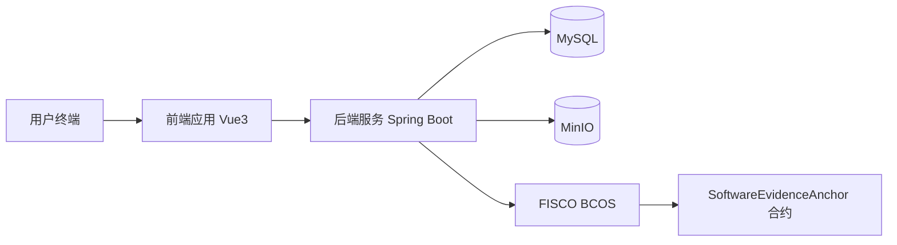
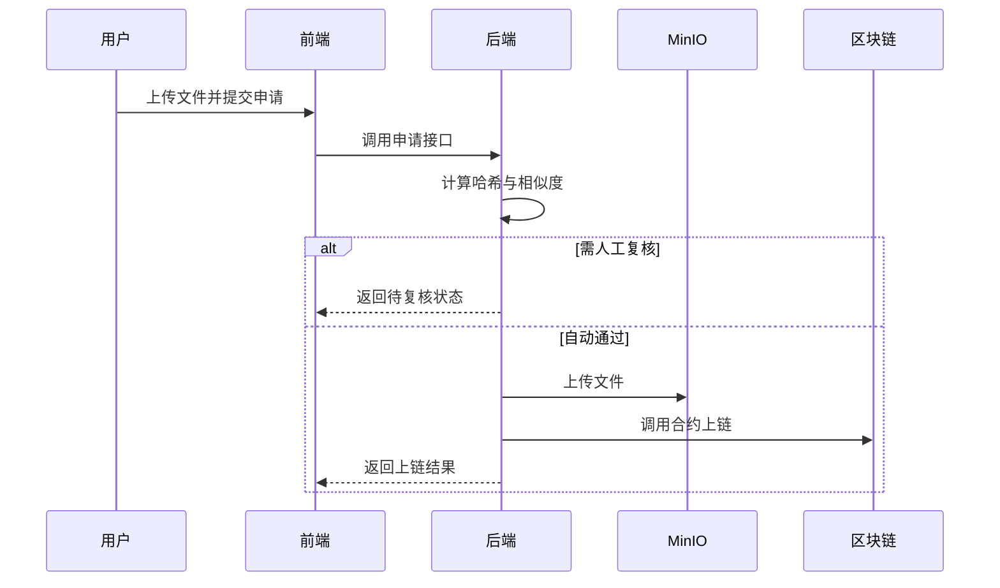

# 版权云链（软件版权溯源与确权平台）

## 程序设计说明书

---

## 文档信息

- **文档名称**：程序设计说明书
- **软件名称**：版权云链
- **副标题**：软件版权溯源与确权平台
- **版本号**：V1.0
- **编制日期**：2026-04-26
- **适用范围**：软件著作权申请文档

---

## 修订记录

| 版本 | 日期 | 修订人 | 修订说明 |
|---|---|---|---|
| V1.0 | 2026-04-26 | 项目组 | 初版编制 |

---

## 目录

1. 引言  
2. 系统总体设计  
3. 功能模块设计  
4. 数据库设计  
5. 接口设计  
6. 安全与权限设计  
7. 关键流程设计  
8. 异常处理设计  
9. 测试设计与结果  
10. 部署与运行说明  
11. 维护与扩展说明  
12. 附录

---

## 1. 引言

### 1.1 编写目的

本文档用于说明“版权云链（软件版权溯源与确权平台）”的软件结构、模块组成、业务流程、接口规范、数据库设计、测试与运行方法，作为软著申请中的技术说明材料。

### 1.2 系统目标

- 实现软件版权存证、溯源查询与确权留痕；
- 构建“提交-核验-复核-上链-审计”业务闭环；
- 支持个人主体和企业主体的版权申请场景；
- 通过区块链提高证据可信度与不可篡改性。

### 1.3 术语定义

- **存证**：将文件摘要及元数据摘要上链形成可验证证据；
- **证据根哈希**：由文件哈希与元数据哈希组合得到的摘要值；
- **语义哈希**：对代码/压缩包进行语义指纹抽取得到的用于相似度判断的哈希；
- **复核**：针对风险申请进行人工审核决策的过程。

---

## 2. 系统总体设计

### 2.1 技术架构

- 前端：Vue 3 + Vite + Element Plus；
- 后端：Spring Boot + Spring Security + MyBatis-Plus；
- 数据层：MySQL；
- 存储层：MinIO；
- 链上层：FISCO BCOS 联盟链 + 智能合约。

### 2.2 分层结构

1. 表示层：Web 页面与交互；
2. 接口层：REST API；
3. 业务层：申请、审核、复核、上链、查询、权限规则；
4. 数据层：实体映射与数据库持久化；
5. 基础设施层：JWT、对象存储、区块链网关。

### 2.3 总体架构图



---

## 3. 功能模块设计

### 3.1 用户认证模块

**功能描述**
- 用户注册、登录；
- JWT 令牌签发与认证；
- 个人信息维护与密码修改。

**输入**
- 用户名、密码、邮箱、手机号等。

**输出**
- 登录令牌、角色信息、主体信息。

### 3.2 版权申请模块

**功能描述**
- 上传软件文件；
- 填写软件名称与描述；
- 生成申请编号并提交受理。

**核心处理**
- 文件哈希计算；
- 规范化/语义指纹提取；
- 申请记录与证据记录写入。

### 3.3 风险评估与复核模块

**功能描述**
- 对比历史语义哈希，计算相似度；
- 命中阈值进入人工复核；
- 复核通过后继续上链，驳回则结束流程。

### 3.4 链上存证模块

**功能描述**
- 读取智能合约地址与链配置；
- 调用合约 `registerEvidence`；
- 记录交易哈希、区块高度、交易状态。

### 3.5 查询溯源模块

**功能描述**
- 按文件哈希查询版权记录；
- 按申请编号查询进度与结果；
- 显示业务状态、审核状态和链上凭证。

### 3.6 审核与后台管理模块

**审核侧**
- 待审记录查询；
- 审核通过/驳回；
- 审核意见留痕。

**管理侧**
- 用户账号管理与角色分配；
- 企业信息联动；
- 版权记录检索与统计查看。

---

## 4. 数据库设计

### 4.1 核心表说明

1. `users`：平台用户与角色主体信息；
2. `enterprise`：企业主体信息；
3. `copyright_application`：申请主表；
4. `copyright_evidence`：证据摘要表；
5. `copyright_records`：上链成功记录表；
6. `onchain_tx`：交易记录表；
7. `file_storage`：文件存储映射表。

### 4.2 关系说明（逻辑）

- 一个申请对应一条或多条交易记录；
- 一个申请对应一条证据摘要记录；
- 一条版权成功记录关联申请编号；
- 一条文件存储记录与证据记录相关联。

---

## 5. 接口设计

### 5.1 认证接口

- `POST /api/auth/login`
- `POST /api/auth/register`
- `POST /api/auth/register/enterprise`
- `GET /api/auth/info`
- `PUT /api/auth/profile`
- `PUT /api/auth/password`

### 5.2 版权业务接口

- `POST /api/copyright/applications`：提交申请  
- `GET /api/copyright/applications/{applicationNo}`：查询申请状态  
- `GET /api/copyright/query/hash/{fileHash}`：按哈希公开查询  
- `GET /api/copyright/query/application/{applicationNo}`：按申请号查询  
- `GET /api/copyright/my-records`：我的记录  
- `GET /api/copyright/enterprise-records`：企业记录

### 5.3 审核接口

- `GET /api/audit/records`
- `GET /api/audit/records/application/{applicationNo}`
- `POST /api/audit/records/{id}/action`
- `POST /api/audit/applications/{id}/action`

### 5.4 管理接口

- 用户、企业、统计、版权管理相关接口（`/api/admin/**`）

---

## 6. 安全与权限设计

### 6.1 安全机制

- 使用 Spring Security 进行接口访问控制；
- 使用 JWT 进行用户会话无状态认证；
- 使用 BCrypt 对密码加密存储；
- 文件原文不上链，仅存储哈希摘要到区块链。

### 6.2 角色权限

- 个人开发者：提交与查看个人申请；
- 企业开发者：提交与查看授权范围记录；
- 企业法务：根据授权范围查看企业记录；
- 审核员：处理审核/复核任务；
- 管理员：账号、角色、统计与全局管理。

---

## 7. 关键流程设计

### 7.1 存证申请流程



### 7.2 复核流程

- 审核员查看待复核申请；
- 选择通过或驳回；
- 通过时系统继续执行上链；
- 驳回时记录驳回原因并终止流程。

---

## 8. 异常处理设计

### 8.1 业务异常

- 文件重复提交；
- 参数校验失败；
- 权限不足；
- 申请状态不允许重复处理。

### 8.2 基础设施异常

- MinIO 上传失败；
- 区块链交易失败；
- 合约地址配置错误或网络连接异常。

### 8.3 异常记录

- 通过统一错误响应返回消息；
- 关键异常写入日志；
- 上链失败信息记录到 `onchain_tx` 表。

---

## 9. 测试设计与结果

### 9.1 单元测试

- 指纹算法测试：语义哈希稳定性与相似度变化；
- 权限规则测试：角色兼容性与规范化逻辑。

### 9.2 集成测试建议

- 注册登录与权限边界测试；
- 申请、复核、上链主流程测试；
- 查询接口准确性与一致性测试；
- 管理员后台账号管理操作测试。

### 9.3 测试结论

系统具备完整流程闭环能力，核心业务状态可跟踪可追溯，满足版权存证与确权平台的功能预期。

---

## 10. 部署与运行说明

### 10.1 部署步骤

1. 准备并启动 MySQL、MinIO、FISCO BCOS；
2. 执行数据库初始化脚本 `db.sql`；
3. 配置后端参数（数据库、MinIO、链配置、合约地址）；
4. 启动后端服务；
5. 启动前端服务。

### 10.2 启动命令示例

后端：

```bash
mvn spring-boot:run
```

前端：

```bash
npm install
npm run dev
```

---

## 11. 维护与扩展说明

- 可扩展更多链上合约版本，实现多链兼容；
- 可接入更细粒度的审计策略与风险模型；
- 可扩展证据类型（源代码、设计文档、构建产物等）；
- 可增加电子签章、时间戳服务等司法辅助能力。

---

## 12. 附录

### 12.1 建议提交的配套材料

- 系统主要界面截图；
- 关键代码节选；
- 数据库表结构说明；
- 测试记录截图或报告；
- 部署配置说明。

### 12.2 版权声明

本系统及相关文档由开发团队独立设计与实现，文档内容用于软件著作权申请资料归档与审查使用。

